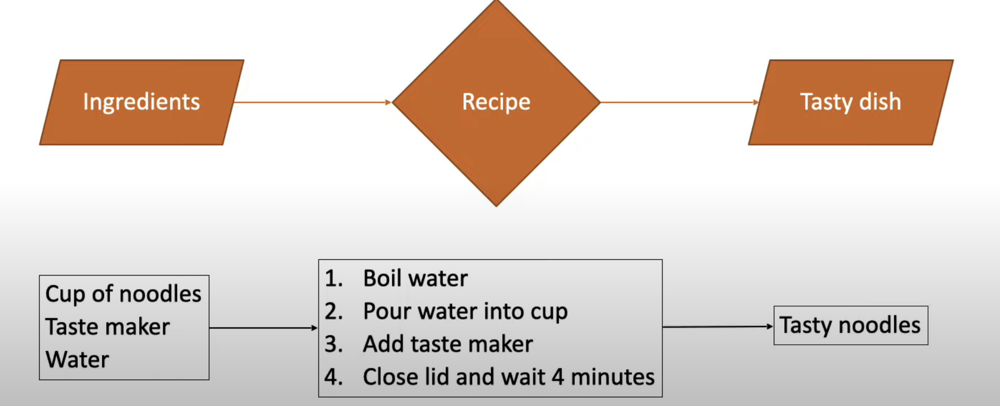
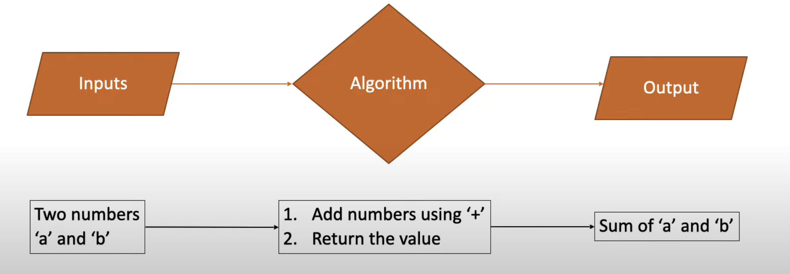

# What is an Algorithm

An algorithm is a set of well-defined instructions to solve a particular problem

## Recipe analogy

- make noodle

## How it works with Programming ?

- consider an Algorithm to add two numbers

## Characteristics of Algorithm

- Well defined inputs and outputs
- Each step should be clear and unambiguous
- Language independent

## Why developes need to learn algorithms?

- As a developer, you're going to come across problems that you need to solve
- Learning algorithms translates to learning different techniques to efficiently solve those problems
- One problem can be solved in many ways using different algorithms
- Every algorithm comes with its own tradeoffs when it comes to performance

## How to measure efficiency(performance) of an Algorithm?

- we have 2 parameters to check the efficiency of an algo
  1. time complexity
  2. space complexity
