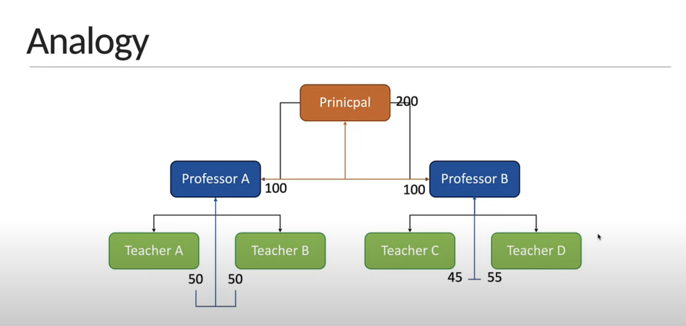

# Recursion

## What is Recursion?

- Recursion is a problem solving technique where the solution depends on solutions to smaller instances of the same problem
- or we can say Recursion is when a function calls itself

## why we need Recursion?

- it a great technique to simplify your solution
- If you find yourself breaking down your problem into smaller versions of the same problem, recursion is very useful

## Analogy

## A few points about recursion

- Every recursive solution needs to have a base case - a condition to terminate the recursion.
- Recursion might simplify solving a problem but it does not always translate to a faster solution.
- A recursive solution may be far worse compared to an iterative solution. 🤪

## Tips for recursive solutions

1. Figure out how to break down the problem into smaller versions of the same problem
2. Identify the base case for recursion
