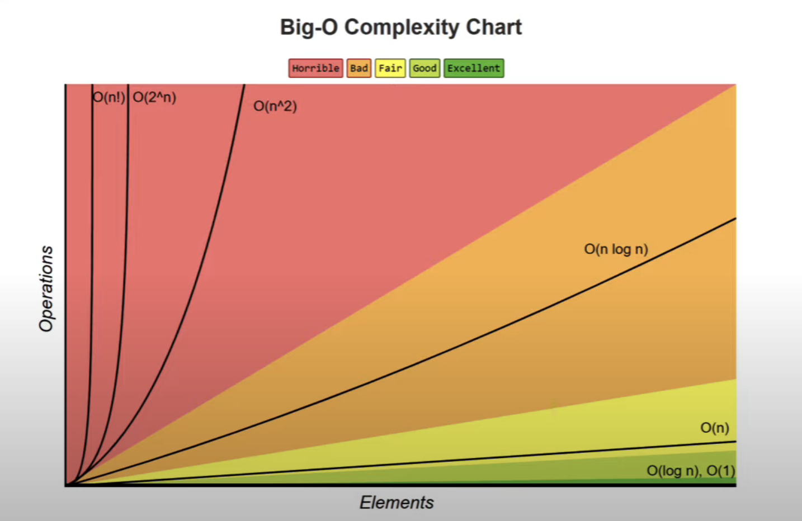

# Big-O Notation



- The worst case complexity of an algorithm is represented using the Big-O notation
- Big-O notation describes the complexity of an algorithm using algebraic terms
- It has two important characteristics
  - It is expressed in terms of the input (n)
  - It focuses on the bigger picture without getting caught up in the minute details

## Time Complexity :

Examples :

1. O(1) - constant

```js
function summation(n) {
  return (n * (n + 1)) / 2;
}
```

2. O(n) - linear

```js
function summation(n) {
  let sum = 0;
  for (let i = 1; i <= n; i++) {
    sum += i;
  }
  return sum;
}
```

3. O(n^2) -Quadratic

```ts
for(){
    for(){

    }
}
```

4. O(log n) - Logarithmic
   Input size reduces by half every iteration

## Space complexity

- O(1) - Constant : eg. shorting algos which sorted within the array without needing extra space
- O(n) - Linear
- O(log n) - Logarithmic
