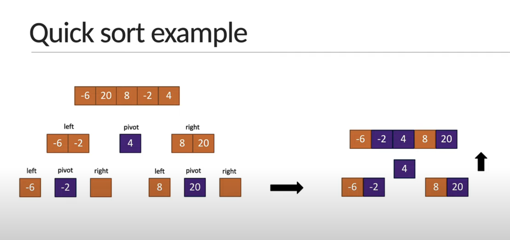

# Quick sort

1. Identify the pivot element in the array
   - Pick first element as pivot
   - Pick last element as pivot (Our approach)
   - Pick a random element as pivot
   - Pick median as pivot
2. Put everything that's smaller than the pivot into a 'left' array and everything that's greater than the pivot into a 'right' array
3. Repeat the process for the individual left' and 'right' arrays till you have an array of length 1 which is sorted by definition
4. Repeatedly concatenate the left array, pivot and right array till one sorted array remains
