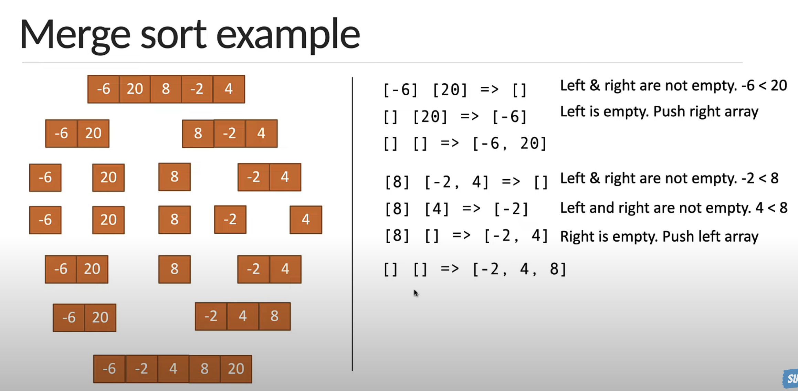
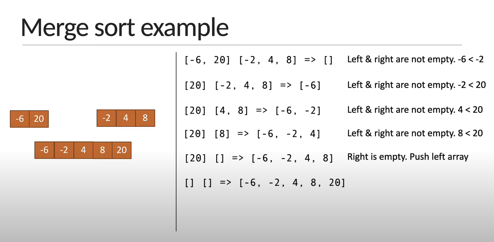

# Merge sort idea

- Divide the array into sub arrays, each containing only one element (An array with one element is considered sorted)
- Repeatedly merge the sub arrays to produce new sorted sub arrays until there is only one sub array remaining. That will be the sorted array.
