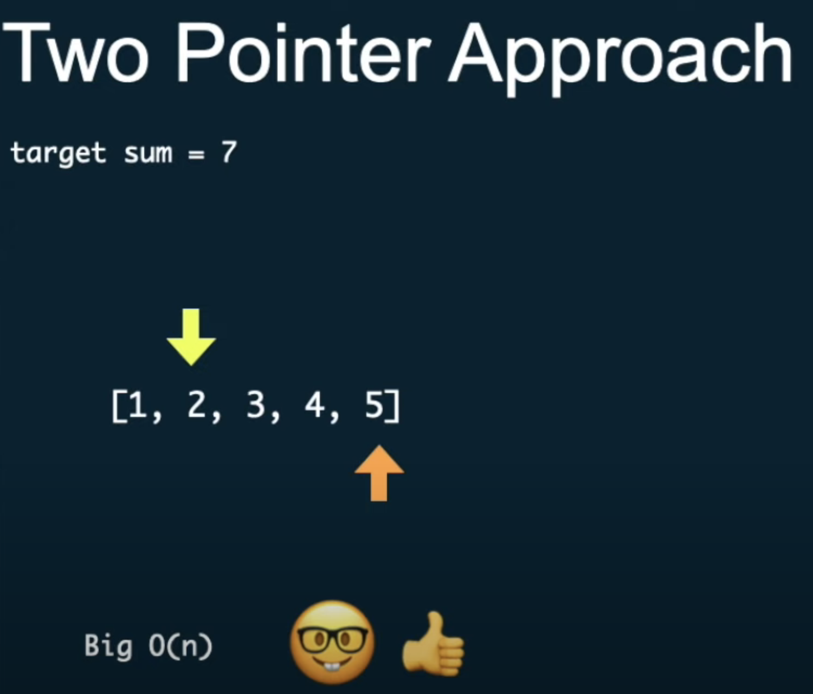

[youtube CoderByte](https://www.youtube.com/watch?v=8XHE3nzjIOA)

# Two Pointers ?

## When to use Two Pointers?

- In many problems involving arrays (usually shorted) or string or linked lists where you need to find a set of elements that fulfill certain constraints.
- we can use the Two Pointers pattern to avoid looping over the array multiple times.
- Because we use two pointers, we are able to process two elements per loop instead of just one.

## Common patterns in the Two Pointer approach are:

1. Two pointers, each starting from the beginning and the end until they both meet
2. One pointer moving at a slow pace, while the other pointer moves at twice the speed

## Common problems :

1. Given an array of sorted numbers and a target sum, find a pair in the array whose sum is equal to the given target.
   [1, 2, 3, 4, 5], target sum = 7

- Ans : [5, 2]
  
