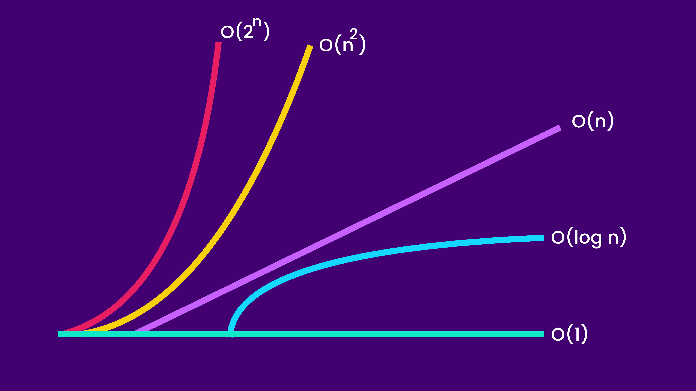

# Asymptotic notation

- There are 3 types of asymptotic notation
  - Big Oh(O) vs Big Omega(Ω) vs Big Theta(θ)

1. Big Oh(O) : It represents Worst case scenario
2. Big Omega(Ω) : It represents Best case scenario
3. Big Theta(θ) : It represents Average case scenario

## 1. Big O

- we use big O to describe the performance of an algorithm.
- means how the algorithm will perform when input data set grow large.

### traditional wikipedia definition

- Big O notation is a mathematical notation that describes the limiting behavior of a function when the argument tends towards a particular value or infinity.

## Note :

### 1 < log(n) < sqrt(n) < n < n.log(n) < n^2 < n^3 <.....< n^n
