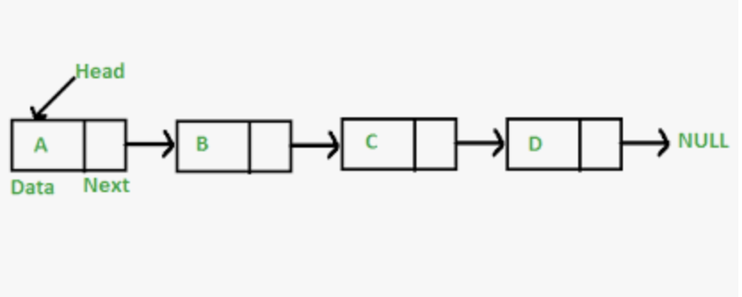
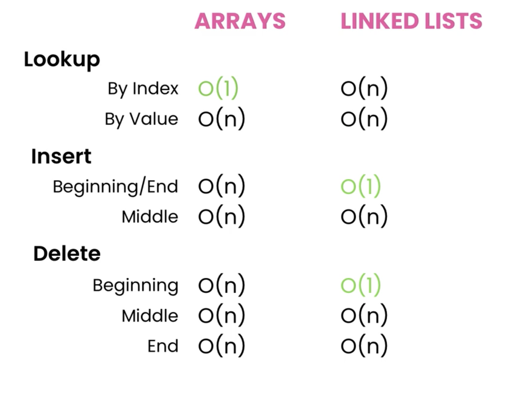

# Linked List

- A linked list is a linear data structure, in which the elements are not stored at contiguous memory locations. The elements in a linked list are linked using pointers.
- In simple words, a linked list consists of nodes where each node contains a data field and a reference(link) to the next node in the list

## Array vs. LinkedList

- Static arrays have a fixed size
- Dynamic arrays grow by 50-100%
- Linked lists don't waste memory

## When to choose array over linked list

- Use arrays if you know the number of items to store.

## TimeComplexity of Array vs LinkedList

