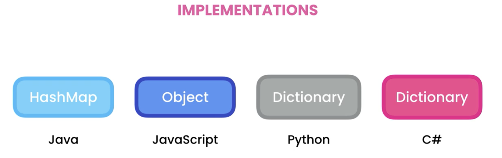

# What are Hash Tables

- Hash Tables gives quick lookup benefit.

## Real life uses of hashTable

1. Spell checkers : to check/suggest word starting for some characters.
2. Dictionaries : to check for that word
3. Compilers : to lookup address of functions and variable

## Hash-Table implementation in diff languages

1. Java - HashMap
2. JavaScript - Object
3. Python - Dictionary
4. C# - Dictionary

# How HashTable works?

- here we store data in {key: value} pair

## Supported operation

1. Insert - O(1)
2. Lookup - O(1)
3. Delete - O(1)
