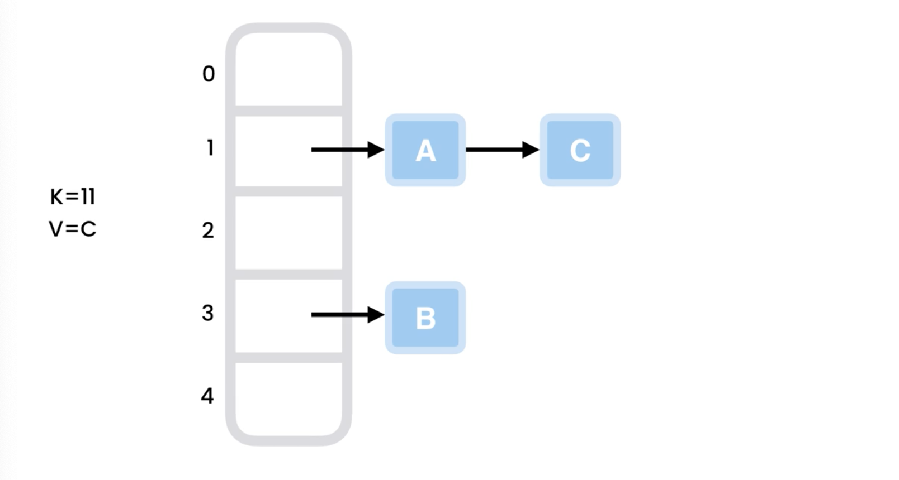
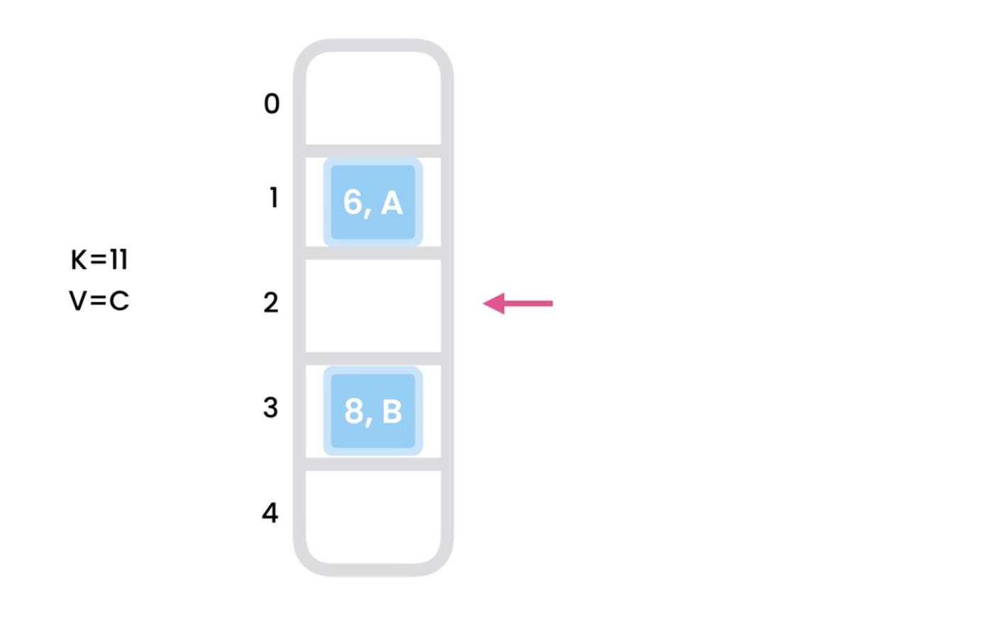
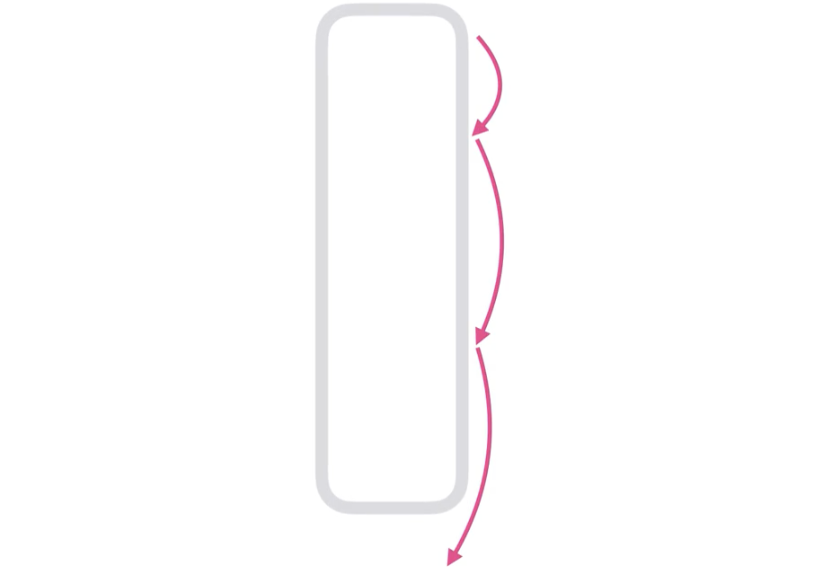
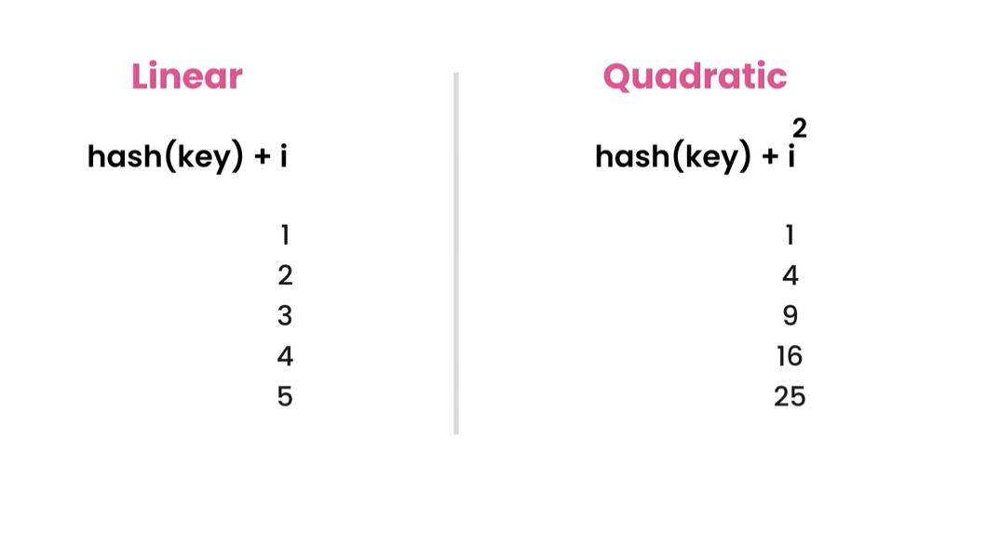

# how hashing works?

- In JS, Object is implementation of hashTable.
- where values can be access super fast using the key.

## N/B:

- Internally hashTable (objects) data is stored in the array in memory.
- and hash the key to create the index for value using the "hash-function".
- and then map the index to value.

## Example :

- for below data

```js
let person = {
  name: "abhi",
  age: 23,
  dept: "engineering",
};
```

- here there are only 3 properties in this object so internally array of size 3 will be created

## Hash Functions

- create a hash function which accepts a big number and returns number(index) between 1-99

```js
const hashFun = (num) => {
  return num % 100;
};
```

## Collision

- When a Hash Function return same value for more than 1 input then this is called collision.
- Collision can be resolved in 2 ways
  1. using linked list: this process is called "chaining"
  2. using "open addressing"

## 1. Chaining



- Chaining is way to resolve collision.
- Chaining uses linked list to store multiple object at same index

## 2. Open addressing

here we don't store value in LinkedList, we directly store values in Array cells/slots.

## 2.1 Linear Probing



- Probing means searching
- In "Linear Probing" if slot for our hashed index is full then we search for next available slot linearly by incrementing i by 1 and put value there.
- Linear Probing formula :

```js
hash(key) + i;
```

- and if all further slots are full then value can't be stored in hash table, it is limitation of Linear Probing.
- all filled slots are called "cluster"

## 2.2 Quadratic Probing



- Quadratic Probing solve Linear probing cluster problem.
- here if slot for our hashed index is full then we search for next available slot Quadratically (by incrementing i by i^2) and put value there.
- Quadratic Probing formula :

  ```js
  (hash(key) + i) ^ 2;
  ```

- Problem with Quadratic Probing : it increase search for empty slot quadratically and we'll reach end of hash table sooner and start over again cyclic and may keep of looking at same place and this may result into infinite loop
- linear vs quadratic probing
  

## 2.3 Double Hashing


- here we hash the object key twice with 2 different hash function

  1. hash1(key) = key % table_size
  2. hash2(key) = prime - (key % prime)
     (here prime is any prime number less than table size)

- Double Hashing function formula:

  ```js
  (hash1(key) + i * hash2(key)) % table_size;
  ```
