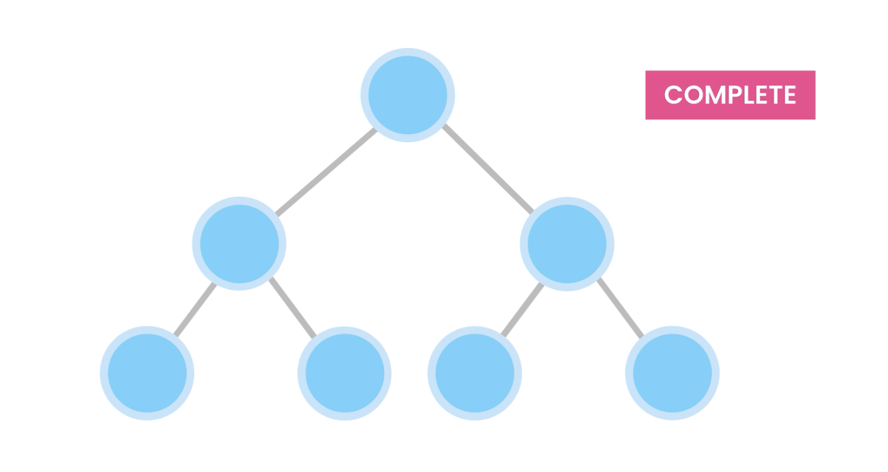
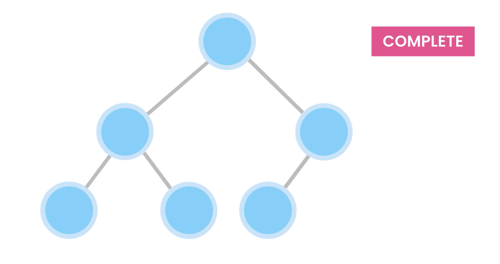
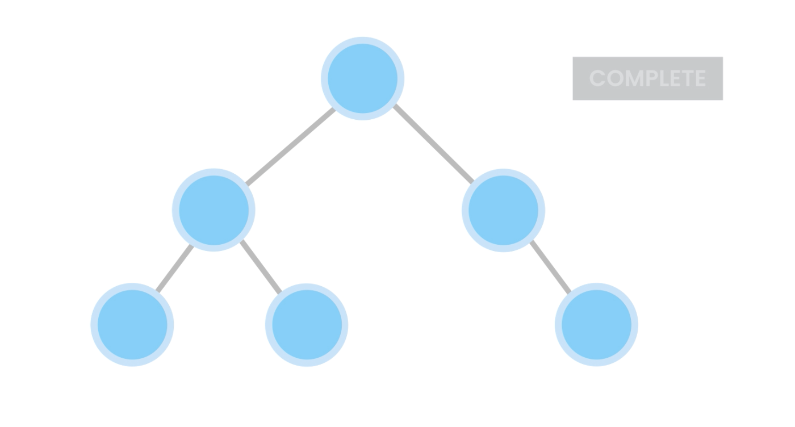
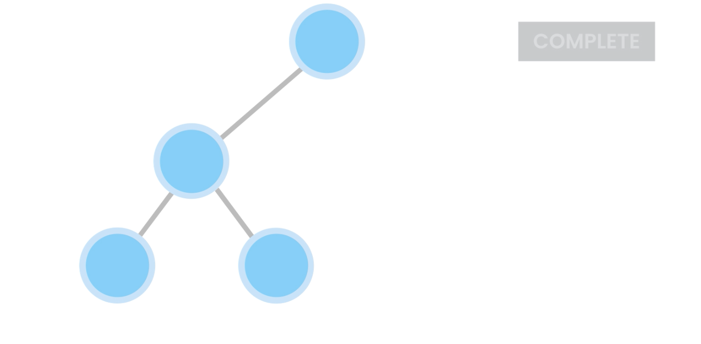
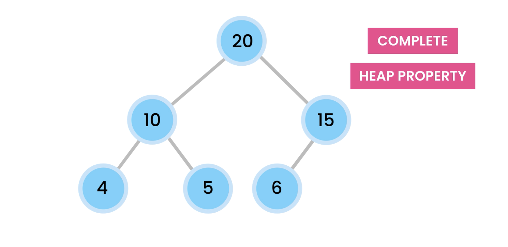
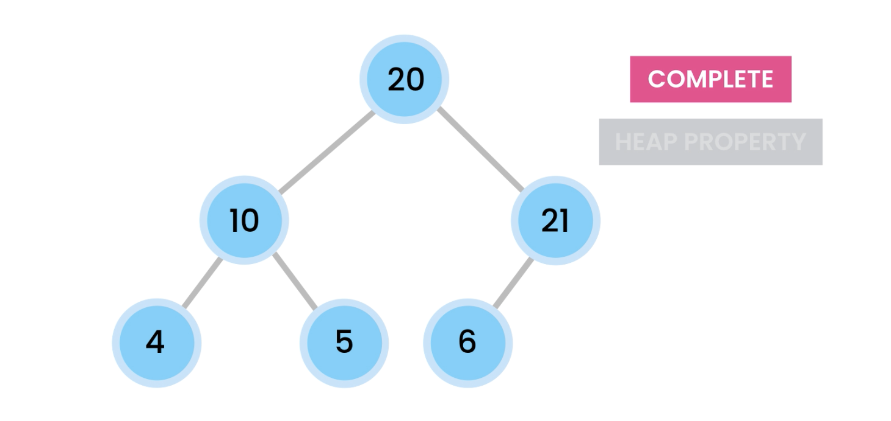

# Heaps

- Heap is complete Binary tree which satisfy heap property.
- NB: More accurately it's called binary heap

## In Detail : What are Heaps?

- Heaps are special type of trees with 2 properties

### 1. COMPLETE

- It should be COMPLETE tree : means All levels are filled except potentially last level. And level are filled from left to the right.
  - Complete Binary Tree
    
    
  - Not Complete Binary Tree
    
    

### 2. HEAP PROPERTY

- The Value of each node should be greater than or equal to it's children
  
  

# Heap Types :

- There are 2 type of heaps

## 1. MAX HEAP

- Heap where root node stores maximum value.

## 2. MIN HEAP

- Heap where root node stores minimum value.

## Heaps Application

1. Sorting (HeapSort): used for sorting data
2. Graph algorithms (shortest path): Use to find shortest path between 2 nodes in graph. (used in GPS)
3. Priority Queues : used to implement Priority Queues
4. Finding the Kth smallest/largest value

## Population the Heap

- Process (for max heap) :
  - make sure each node should be greater than or equal to it's children
  - for that Insert the new item in the leaf node from left to right
  - and if it's not in right position then we move it up (swipe with parent node) until it's there in right place.
- [10, 5, 17, 4, 22]

## Operations:

1. Inserting the node : O(log n)
   - hight of tree(h) = log n
   - TC = O(h)
2. Deleting the node : O(log n)
3. Maximum Value : O(1)

# Implementing a Heap

- We usually use array to implement a heap even though heap is conceptually a binary tree.
- as heaps are complete binary tree so we don't have holes in them, so it's more efficient to implement them using array, we don't need Node class with fields for rightChild and rightChild. so it'll have smaller foot print in the memory.
