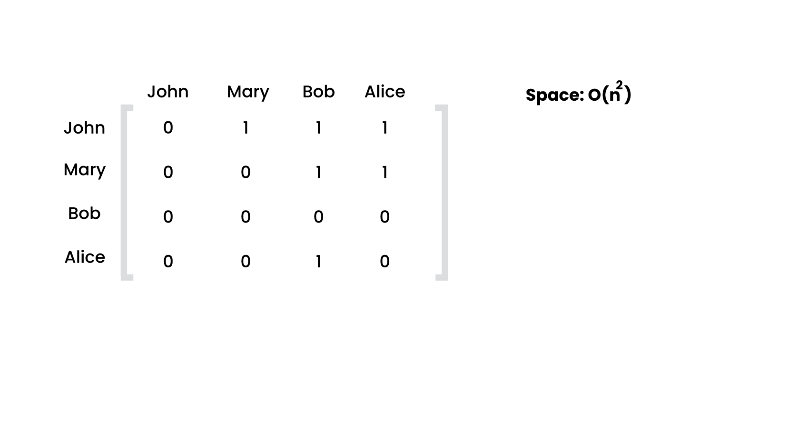
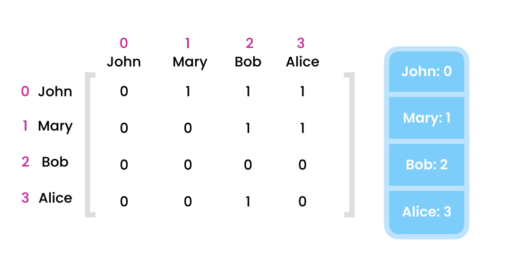
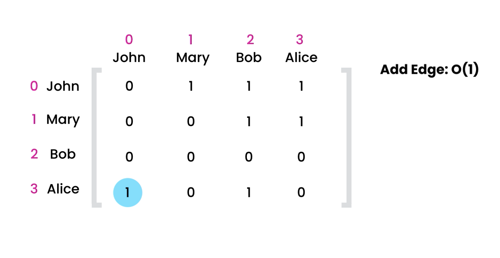
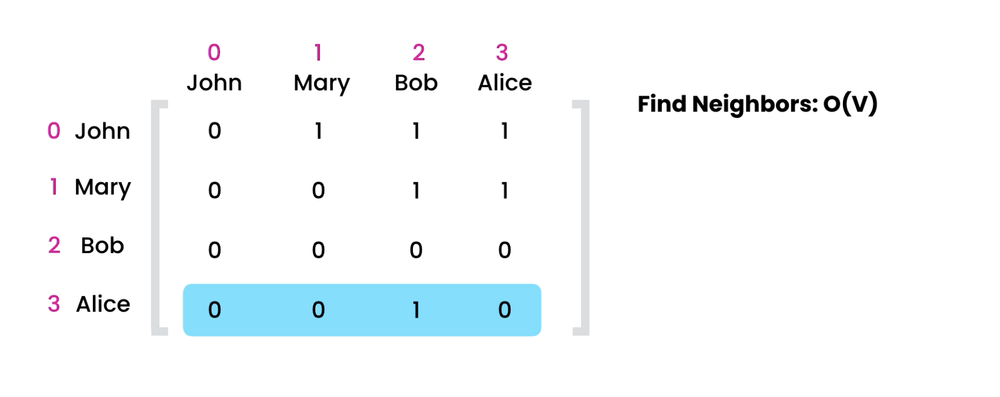
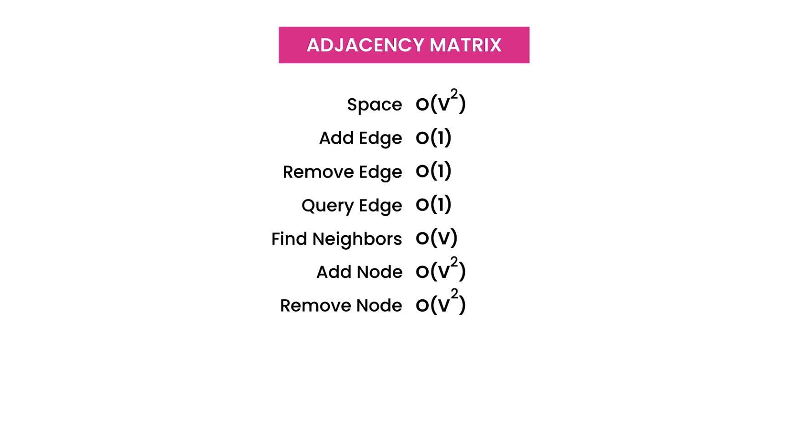

## Adjacency Matrix or 2D array

- It's a matrix of 1 and 0 when two nodes are connected we represent by 1, if not connected then 0

## Problem with "Adjacency Matrix" approach

- it's takes a lot of memory, for n nodes space complexity will be O(n^2), eg. for 1K nodes matrix will have 1M entries

## Operation on Adjacency Matrix and their time complexity:

### 1. Add a node(vertex) : O(V^2)

.png>)

- Eg. : we want to add sam
- we need to create an new matrix with extra raw and column and copy all the existing records into that. which will take TC : O(V^2)

- time complexity : O(v^2) : as existing matrix had v^2 entries.
  v : number of vertices

- N/B: can be optimized by allocating matrix of large size initially, so we don't have to perform copying operation but it'll waste big memory

### 2. Remove a node(vertex) : O(v^2)

- Eg. we want to remove sam
  .png>)

- here also we need to create a smaller matrix and copy the required nodes to it.
- time complexity : O(v^2) : as existing matrix had v^2 entries.
  v : number of vertices

### 3. Adding an edge(connection) : O(1)

Eg. we want to add edge(connection) from Alice to John

- Steps :
  1. find index of these nodes :
  2. we can use hash-table (object in JS) to store the nodes and their indexes in adjacency matrix
  3. finding elements in hash-table is O(1), so we can find the index in O(1)
  4. so once we have index we can changes the value at that index from (0 to 1).
- time complexity : O(1)

### 4. Removing an edge(connection) : O(1)

- same as adding can edge, we need to go the required index and changes it from (1 to 0)
- time complexity : O(1)

### 5. checking an edge(connection) : O(1)

- check if Alice and John are connected
- same as adding can edge, we need to go the required index and check it's value if 1 => connected, 0 => not connected
- time complexity : O(1)

### 6. Finding adjacent/directly-connected/neighboring nodes : O(V)

- Eg. Find all the neighbors of Alice
- Steps :
  1. find the index of alice in matrix => TC = O(1)
  2. look of every element in this raw to find the connected node, here 1=> connected, 0=> not-connected ; TC : O(V)
- time complexity : O(V)
- is not good because of there are 1M people and alice is just connected to 3,still we have to iterate over 1M nodes to check

## Summary :

