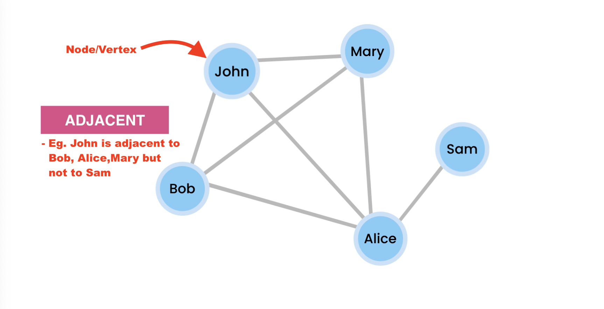

# what and why graph?

- we we graphs to represent connected objects like routers in an network or people on social media platforms.
- Mathematically a tree is also a graph (a graph without cycle)

- This graph has 4 nodes(vertices), 6 edges(lines)
- **Adjacent Nodes** : nodes which are directly connected
- **Directed Graph** : if edges have direction, eg: twitter
  - these edges can also have weight.
  - Practical use of weights :
    - eg1: finding shortest path between 2 nodes, when 2 cities are connected then we can use these weights to show the distance/traveling costs etc.
    - eg2: in social media weights can be used to represent the how 2 people frequently talks
      
- **Undirected Graph** : if edges doesn't have direction, eg: linkedin connection

## N/B: when we do time and space complexity analysis on graphs we use V(vertices) and E(edges) instead of n
