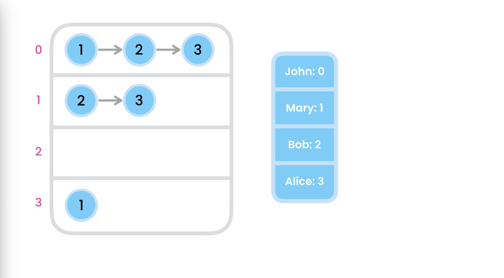
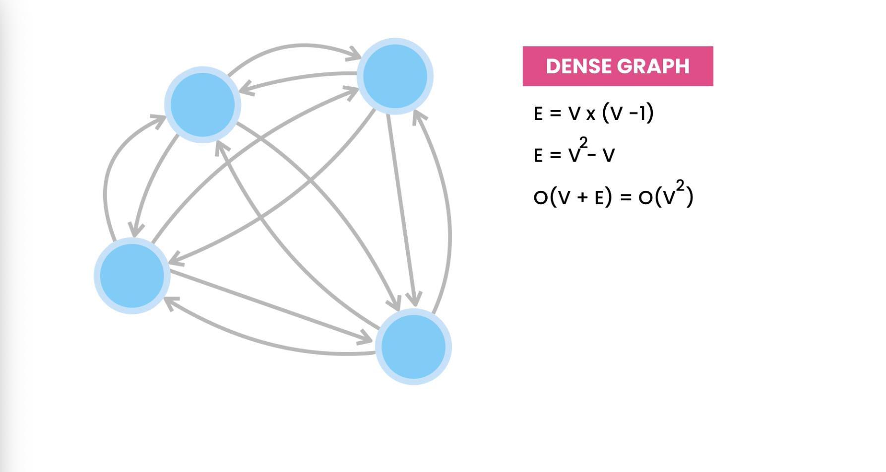
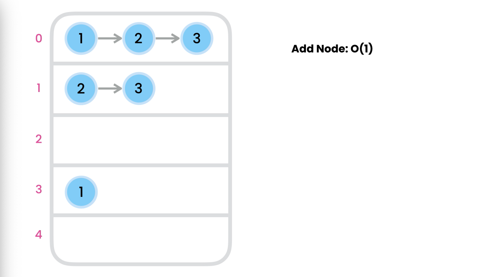
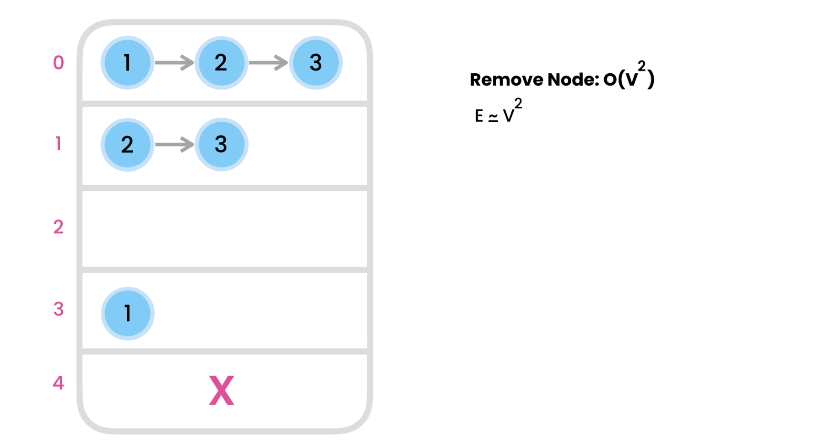
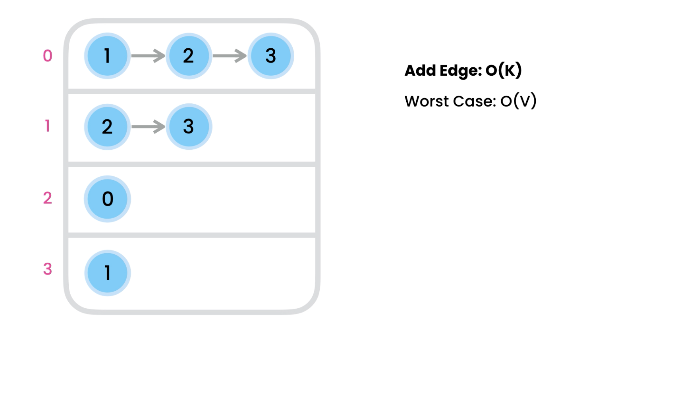
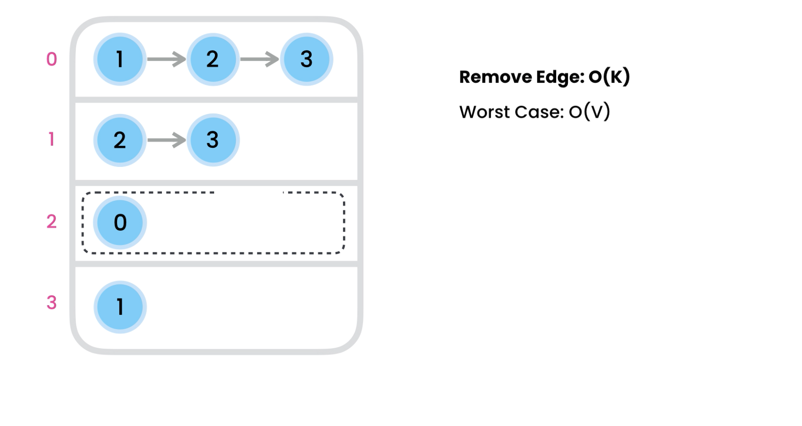
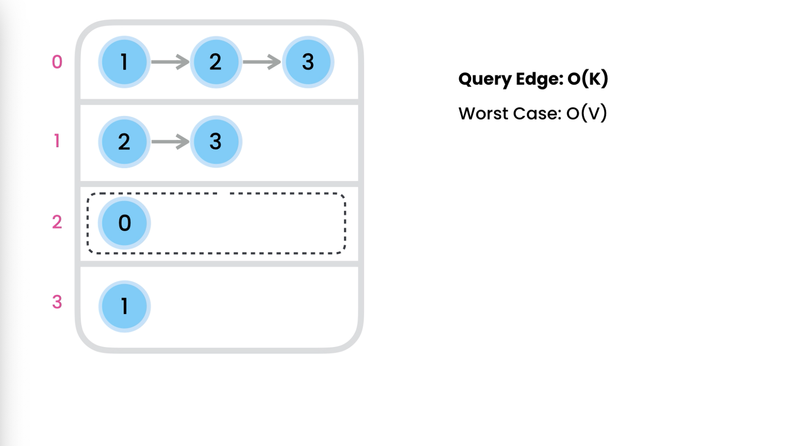
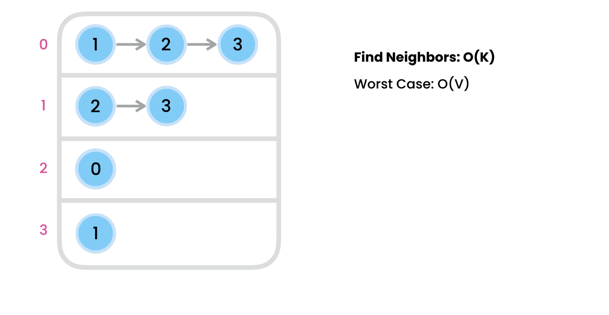
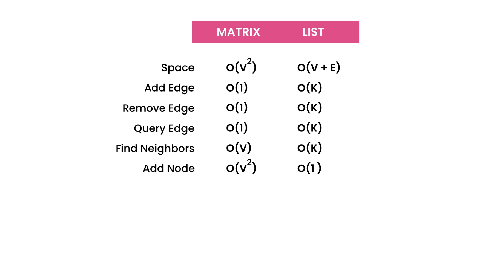
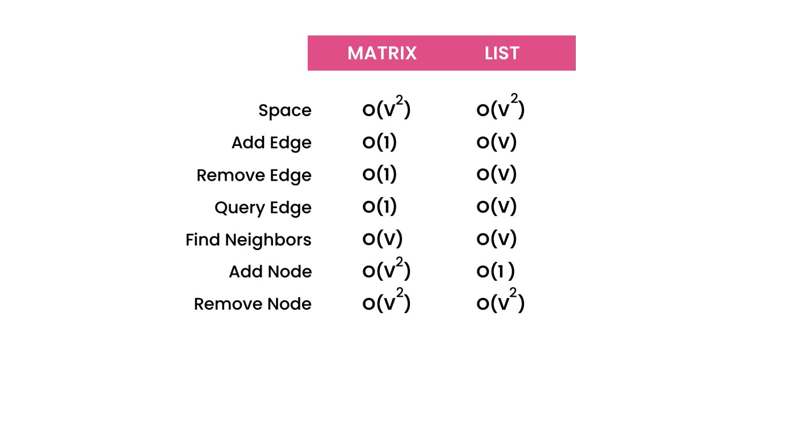

# Adjacency List

- It's an array of linked-lists, [LL1, LL2, LL3, ...]
- every element of this array have a linked-list
- this Linked-list contains adjacent nodes or the neighbors of the given node

## Space complexity :

- here we store the edges which exists(in Adjacency-matrix we store all the edges)
- Space complexity : O(V+E)

### for DENSE GRAPH : E = V\*(V-1)

- where each node is connected with all other nodes
- Adjacency List Space-complexity in case of dense graph: O(V^2)

## Time complexity of various operations :

### 1. adding a node : O(1)

- eg. we already have 4 nodes, now we want to add 1 more node.
  

- to add a node we need to add 1 more element to the list
- time complexity : O(1)

### 2. removing a node : O(V^2)

- eg. we already have 5 nodes, now we want to remove 5th node.
  

- we need to perform 2 operations :
  1. remove corresponding element for adjacency-list
  2. make sure no other node have link to this node, so we have iterate over the adjacency-list and remove the target node from every linked-list
- TC for iterating over adjacency-list : O(V)
- removing a node from Linked-List : O(n)
- So Total TC : O(V+E) = O(V + V^2) = O(v^2)

### 3. Adding an Edge : O(V)

- connect bob(index-2) to john(index-0)
  
- TC :
  1. finding index for bob : O(1) bcz it's stored in hash table
  2. iterate over Linked-List of bob to make sure John(index-0) is not already present :
  - if k nodes are there : O(K)
  - in worst case (V-1) nodes are there : O(V)
- Time complexity : O(V)
- In multi-graphs : O(1)

### 4. Removing an Edge : O(V)

- connect bob(index-2) to john(index-0)
  
- same as adding an edge, we need to find index for node then iterate over it's Linked-List
- TC : O(K) if k edge(connection) is there
- TC : O(V) in worst case

### 5. Checking if two nodes are connected: O(V)

- same as adding an edge, we need to find index for node then iterate over it's Linked-List to see the connection
- TC : O(K) if k edge(connection) is there
- TC : O(V) in worst case

### 6. Finding all the nodes adjacent to given node : O(V)

- same as adding an edge, we need to find index for node then iterate over it's Linked-List to see the connection
- TC : O(K) if k edge(connection) is there
- TC : O(V) in worst case

## Compare

- For normal Graph
  
- For Dense Graph
  

- Both have their own pros and cons
- if graph is dense then use adjacency matrix otherwise use adjacency-list,
- adjacency-list performs better in most of scenarios
