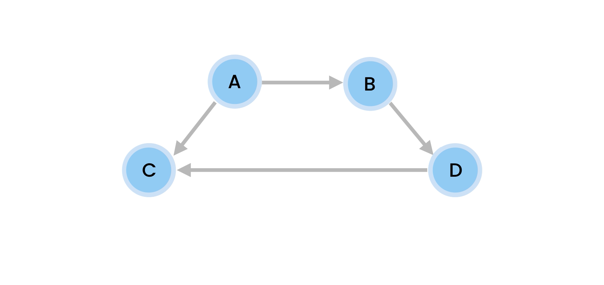

# Approach

- Let's say we have a directed graph with 4 vertices (A, B, C, D)
  

## 1. To represent vertex(node) we'll create a Node class :

```js
class Node {
  constructor(label) {
    this.label = label;
  }
}
```

## 2. To store vertices(nodes) and their Edges(connections) we'll user hash-table data structure in Graph class :

```js
class Graph {
  constructor() {
    this.nodes = {}; //{label : node}
    this.adjacencyList = {}; //{node : new Set([node1, node2])}
  }
}
```

1. we'll use hash-table to store all the nodes, here key will be label and values will be node

```js
nodes = {
  A: new Node("A"),
  B: new Node("B"),
  C: new Node("C"),
  D: new Node("D"),
};
```

2. we'll use hash-table to store all the edges, here key will be node and values will be Set of connected nodes

- here A is connected to B, C
- here B is connected to D
- here C is not connected to any node
- here D is connected to C

```js
adjacencyList = {
  new Node('A') : new Set([new Node('B'), new Node('C')]),
  new Node('B') : new Set([new Node('D')]),
  new Node('C') : new Set([]),
  new Node('D') : new Set([new Node('C')]),
};
```

## methods need to implemented for graph

- below methods will be implemented in graph class

1.  addNode(label)
2.  removeNode(label)
3.  addEdge(from, to)
4.  removeEdge(from, to)
5.  print()
    - A is connected with [B,C]
    - B is connected with [A]
