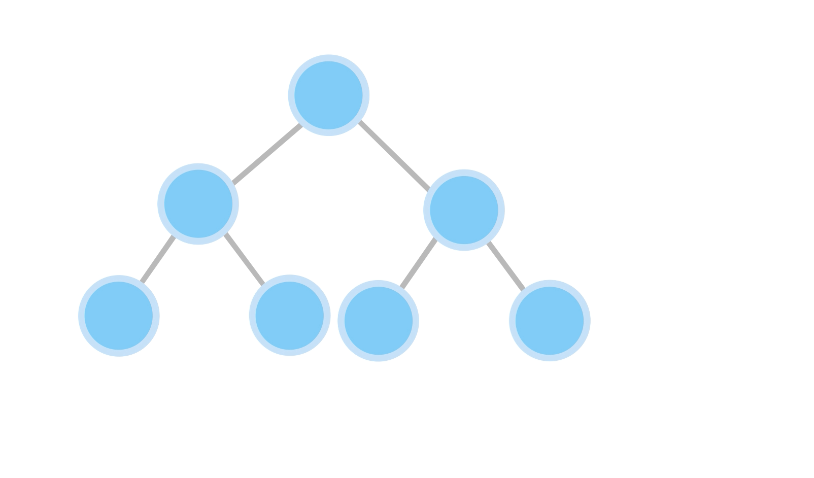
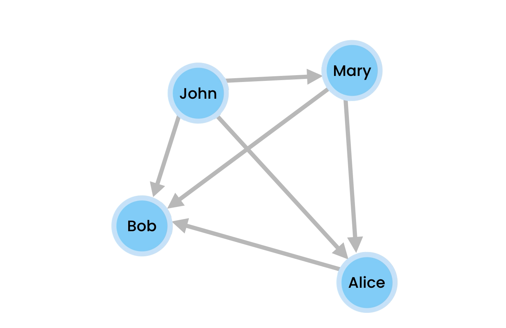

# Graph Traversal Algorithms :

- similar to Trees in graphs also we have 2 traversal algorithms

1. Depth First Traversal
2. Breadth First Traversal

- In tree we always start our traversal from root node and all other nodes are reachable from root node.
  
- But in graph we can start traversal from any node and only those nodes are reachable which are connected with this node.
  
- here if we start from "john" we can reach all the nodes but if we start from "bob" then no other nodes are reachable as it's not connected to any other node.

# 1. Depth First Traversal

- We can use recursion or iteration to implement this algorithm
