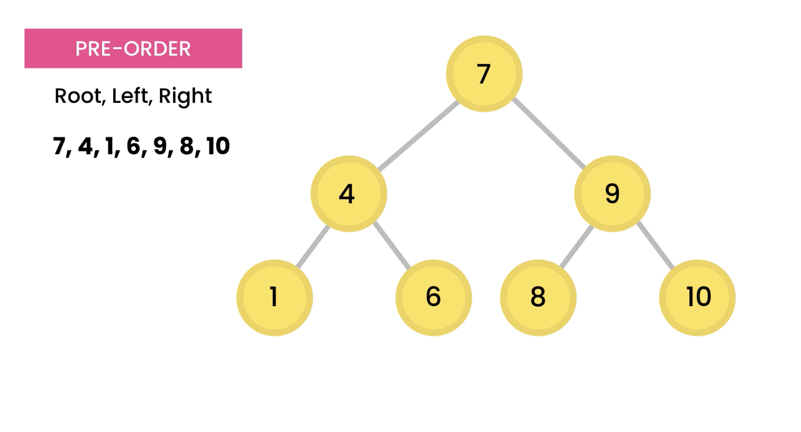
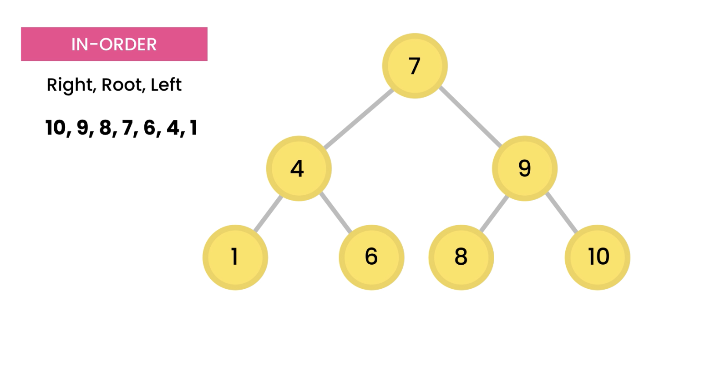
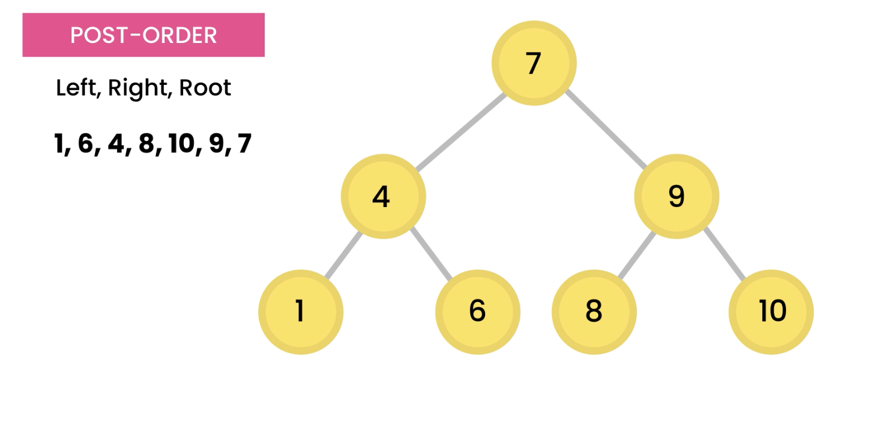

# DFS (Depth First Search) :

- 3 different ways are there
- Pre-order : Root, Left, Right
- In-order : Left, Root, Right
- Post-order : Left, Right, Root

## Pre-order

- order of traversal : Root, Left, Right
  

## In-order

- order of traversal : Left, Root, Right
- O/P of In-order is in sorted order
  - Left, Root, Right : ascending order
    
  - Right, Root, Left : descending order
    

## Post-order

- order of traversal : Left, Right, Root
- O/P of Post-order is like traversing from leaf to root.
  
