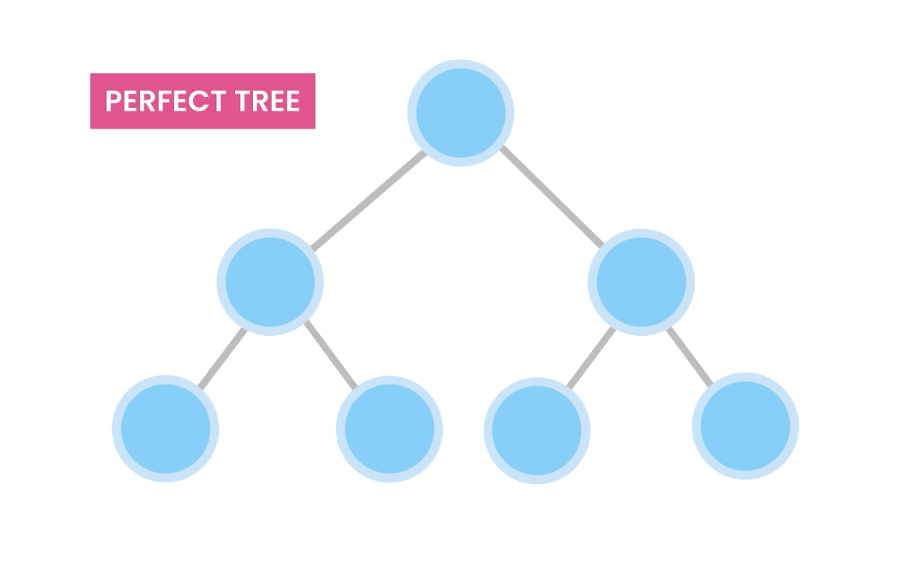
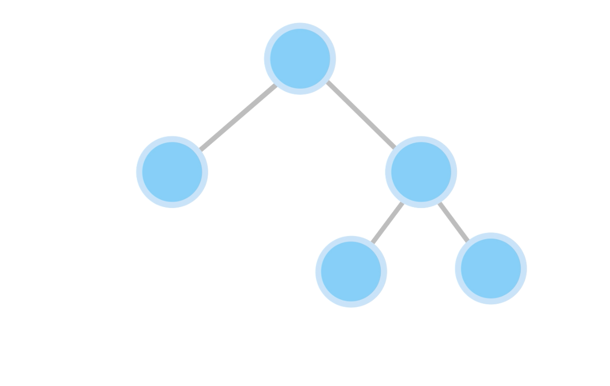
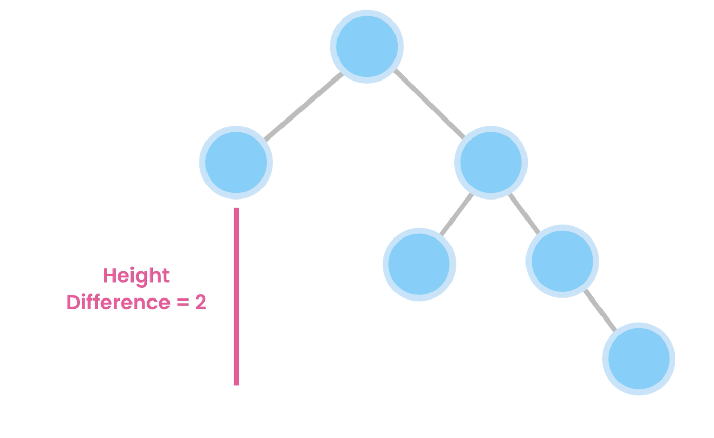
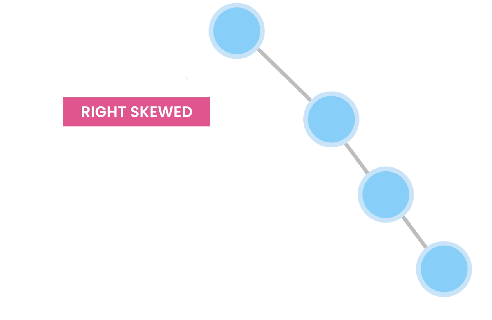
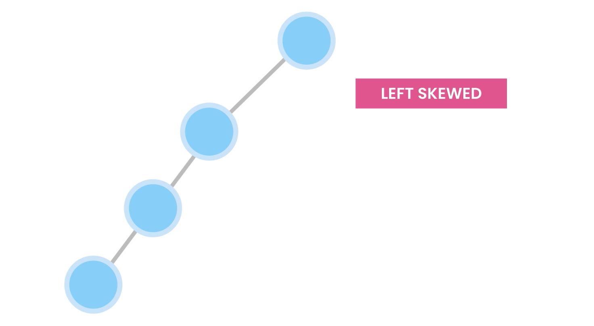

# Tree Type

## 1. Perfect tree

- (height of left sub tree) = (height of right sub tree)

## 2. Balanced tree

- (height of left sub tree)- (height of right sub tree) <= 1

## 3. Un-Balanced tree

- (height of left sub tree)- (height of right sub tree) > 1

## 4. Skewed tree

### 4.1 Right skewed tree

- it is type of Unbalanced tree
- it has only right child

### 4.2 Left skewed tree

- it is type of Unbalanced tree
- it has only left child

# How any tree become skewed?

- if we insert elements is sorted order then tree become skewed.
- if order of insertion is ascending then tree will become right-skewed
- if order of insertion is descending then tree will become left-skewed

## N/B :

- Left/right skewed trees are like linked list where 1 node holds the reference of next node.
- and here time complexity of traversal is O(n).
- time complexity of any tree algo will increase if tree is not balanced.

## How to balance a tree?

- there are many algorithm of balance a tree.

# some other self-balancing trees

- AVL Tree
- Red-black trees
- B-trees
- Splay Trees
- 2-3 Trees
